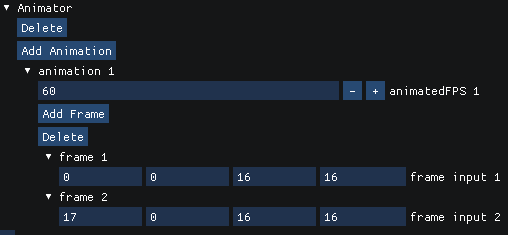

An animation is a struct that contains information to animate 2d sprites via sprite sheets. Currently, we can set a frames per second value, along with a `frames` array. The `frames` array contains the crops of each animation frame from the sprite sheet that is being used. 

### Properties

| Property | Description                      |
|-------------------------------------------------------------------------------|---------------------------------------------------------------------------|
| [animatedFPS](/JulGame.jl/reference/animation/properties/animatedfps/)           | The amount of `frames` that will be shown per second. |
| [frames](/JulGame.jl/reference/animation/properties/frames/)           | An array of `Vector4` that holds data about cropping the current `sprite`. |

### In the Editor
In the JulGame editor, an animation will always appear as a child of an animator.

Starting in 0.1.0, there is a visual animation editor, along with image previews of the sprite.