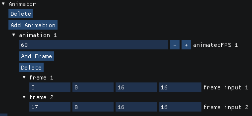

### Properties

| Property | Description                    |
|-------------------------------------------------------------------------------|---------------------------------------------------------------------------|
| [animations](/JulGame.jl/reference/animator/properties/animations/)           | An array of [Animations](/JulGame.jl/reference/animation/animation/). |
| [currentAnimation](/JulGame.jl/reference/animator/properties/currentAnimation/)           | The current animation in use by the animator. |

### Public Functions

| Method | Description |
|-----------------------------------------------------------------------|---------------|
| [force_frame_update](/JulGame.jl/reference/animator/functions/force_frame_update/) | Updates the sprite crop of the animator to the specified frame index. |

### In the Editor

